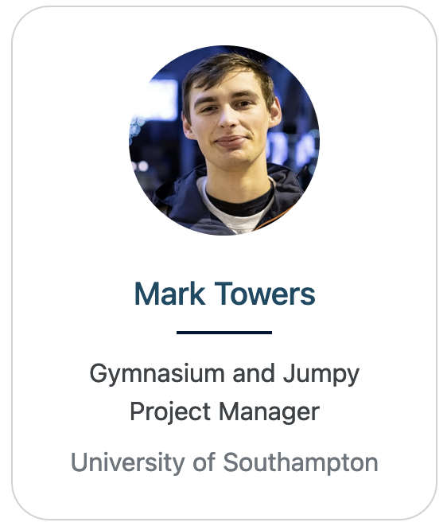
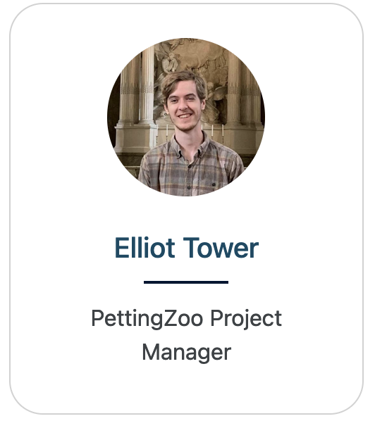

# Shimmy

An API conversion tool for popular external reinforcement learning environments to [Gymnasium](https://github.com/farama-Foundation/gymnasium) and [PettingZoo](https://github.com/farama-Foundation/pettingZoo/) APIs.

## Supported APIs

### [OpenAI Gym](http://shimmy.farama.org/contents/gym/)
- Bindings to convert [OpenAI Gym](https://github.com/openai/gym) environments to [Gymnasium](https://gymnasium.farama.org/).

### [Atari Environments for OpenAI Gym](http://shimmy.farama.org/contents/atari/)
- Bindings to convert [ALE-py](https://github.com/mgbellemare/Arcade-Learning-Environment) Atari environments to [Gymnasium](https://gymnasium.farama.org/).

### [DeepMind Control](http://shimmy.farama.org/contents/dm_control/)
- Bindings to convert [DM Control](https://github.com/deepmind/dm_control/) environments to [Gymnasium](https://gymnasium.farama.org/). 

### [DeepMind Control: Multi-Agent](http://shimmy.farama.org/contents/dm_multi/)
- Bindings to convert [DM Control Soccer](https://github.com/deepmind/dm_control/blob/main/dm_control/locomotion/soccer/README.md) environments to [PettingZoo](https://pettingzoo.farama.org/).

### [DMLab](http://shimmy.farama.org/contents/dm_lab/)
- Bindings to convert all [DM Lab](https://github.com/deepmind/lab) environments to [PettingZoo](https://pettingzoo.farama.org/).

### [OpenSpiel](shimmy.farama.org/contents/open_spiel/)
- Bindings to convert all [OpenSpiel](https://github.com/deepmind/open_spiel) enviromnets to [PettingZoo](https://pettingzoo.farama.org/).

### [Behavior Suite](http://shimmy.farama.org/contents/bsuite/)
- Bindings to convert all [Behavior Suite](https://github.com/deepmind/bsuite) environments to [Gymnasium](https://gymnasium.farama.org/).

### [Melting Pot](http://shimmy.farama.org/contents/meltingpot/)
- Bindings to convert all [Melting Pot](https://github.com/deepmind/meltingpot) environments to [PettingZoo](https://pettingzoo.farama.org/).


## Installation and Usage

To install Shimmy from PyPI:
```
pip install shimmy
```
Out of the box, Shimmy doesn't install any of the dependencies required for the environments it supports.
To install them, you'll have to install the optional extras (e.g., `pip install shimmy[dm_lab]`).

All single agent environments have registration under the [Gymnasium API](https://gymnasium.farama.org/api/registry/), while all multiagent environments must be wrapped using the corresponding compatibility wrappers.

### For Developers and Testing Only
```
pip install shimmy[testing]
```

### To just install everything
```
pip install shimmy[all, testing]
```

## At a glance

This is an example of using Shimmy to convert DM Control environments into a Gymnasium compatible environment:

```python
import gymnasium as gym
from shimmy.registration import DM_CONTROL_SUITE_ENVS

env_ids = [f"dm_control/{'-'.join(item)}-v0" for item in DM_CONTROL_SUITE_ENVS]
print(env_ids)

env = gym.make(env_ids[0])
env_flatten = gym.wrappers.FlattenObservation(env)
print(env_ids[0])
print("===🌎", env.observation_space)
print("===🕹️", env.action_space)
print("---flattened 🌎", env_flatten.observation_space)
print("---flattened 🕹️", env_flatten.action_space)
```
```bash
['dm_control/acrobot-swingup-v0', 'dm_control/acrobot-swingup_sparse-v0', 'dm_control/ball_in_cup-catch-v0', 'dm_control/cartpole-balance-v0', 'dm_control/cartpole-balance_sparse-v0', 'dm_control/cartpole-swingup-v0', 'dm_control/cartpole-swingup_sparse-v0', 'dm_control/cartpole-two_poles-v0', 'dm_control/cartpole-three_poles-v0', 'dm_control/cheetah-run-v0', 'dm_control/dog-stand-v0', 'dm_control/dog-walk-v0', 'dm_control/dog-trot-v0', 'dm_control/dog-run-v0', 'dm_control/dog-fetch-v0', 'dm_control/finger-spin-v0', 'dm_control/finger-turn_easy-v0', 'dm_control/finger-turn_hard-v0', 'dm_control/fish-upright-v0', 'dm_control/fish-swim-v0', 'dm_control/hopper-stand-v0', 'dm_control/hopper-hop-v0', 'dm_control/humanoid-stand-v0', 'dm_control/humanoid-walk-v0', 'dm_control/humanoid-run-v0', 'dm_control/humanoid-run_pure_state-v0', 'dm_control/humanoid_CMU-stand-v0', 'dm_control/humanoid_CMU-run-v0', 'dm_control/lqr-lqr_2_1-v0', 'dm_control/lqr-lqr_6_2-v0', 'dm_control/manipulator-bring_ball-v0', 'dm_control/manipulator-bring_peg-v0', 'dm_control/manipulator-insert_ball-v0', 'dm_control/manipulator-insert_peg-v0', 'dm_control/pendulum-swingup-v0', 'dm_control/point_mass-easy-v0', 'dm_control/point_mass-hard-v0', 'dm_control/quadruped-walk-v0', 'dm_control/quadruped-run-v0', 'dm_control/quadruped-escape-v0', 'dm_control/quadruped-fetch-v0', 'dm_control/reacher-easy-v0', 'dm_control/reacher-hard-v0', 'dm_control/stacker-stack_2-v0', 'dm_control/stacker-stack_4-v0', 'dm_control/swimmer-swimmer6-v0', 'dm_control/swimmer-swimmer15-v0', 'dm_control/walker-stand-v0', 'dm_control/walker-walk-v0', 'dm_control/walker-run-v0']
dm_control/acrobot-swingup-v0
===🌎 Dict('orientations': Box(-inf, inf, (4,), float64), 'velocity': Box(-inf, inf, (2,), float64))
===🕹️ Box(-1.0, 1.0, (1,), float64)
---flattened 🌎 Box(-inf, inf, (6,), float64)
---flattened 🕹️ Box(-1.0, 1.0, (1,), float64)
```

For most usage, we recommend applying the `gym.wrappers.FlattenObservation(env)` wrapper to reduce the `Dict` observation space to a `Box` observation space.

## Project Maintainers
<h3 style="text-align: center;width: 60%">
    <a href="https://github.com/pseudo-rnd-thoughts">
        
    </a>
    <a href="https://github.com/jjshoots">
        
    </a>
    <a href="https://github.com/elliottower/">
        
    </a>
</h3>

## Citation

If you use this in your research, please cite:
```
@software{shimmy2022github,
  author = {{Jun Jet Tai, Mark Towers} and Elliot Tower and Jordan Terry},
  title = {Shimmy: Gymnasium and Pettingzoo Wrappers for Commonly Used Environments},
  url = {http://github.com/Farama-Foundation/Shimmy},
  version = {0.2.0},
  year = {2022},
}
```
